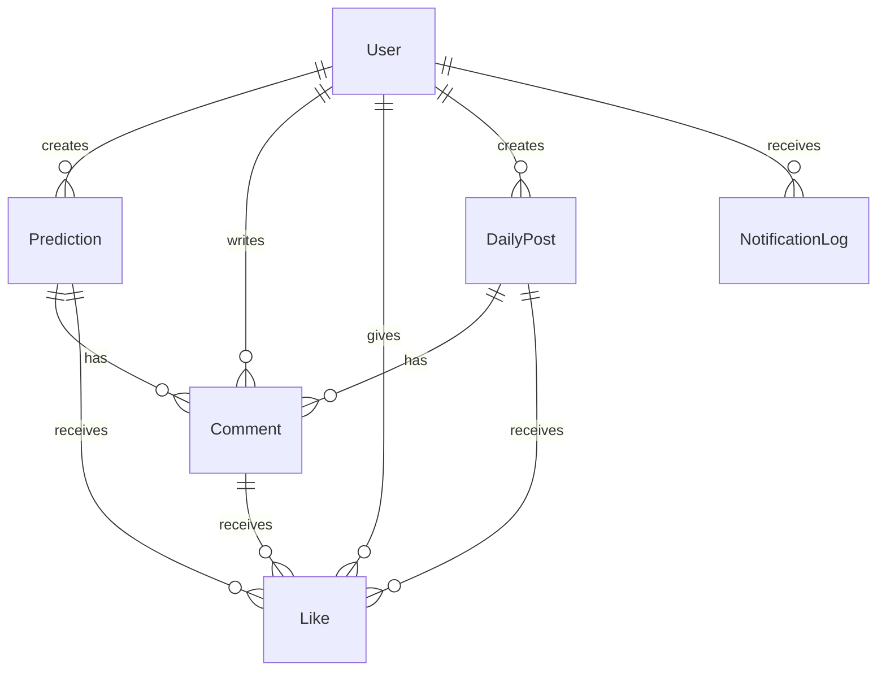

# 🎯 VurduGololdu API

**VurduGololdu** - Tahmin ve analiz platformu API'si
Frontend Url: "https://github.com/SerhatCelebi/PredicAnalysisSite.Frontend"

## 📋 İçindekiler

- [Genel Bakış](#genel-bakış)
- [🚀 Hızlı Başlangıç](#-hızlı-başlangıç)
- [🏗️ Teknoloji Stack](#️-teknoloji-stack)
- [📁 Proje Yapısı](#-proje-yapısı)
- [🔧 Konfigürasyon](#-konfigürasyon)
- [🔐 Güvenlik](#-güvenlik)
- [📊 API Endpoints](#-api-endpoints)
- [🎭 Roller ve Yetkiler](#-roller-ve-yetkiler)
- [💾 Veritabanı](#-veritabanı)
- [🔔 Bildirim Sistemi](#-bildirim-sistemi)
- [👍 Like Sistemi](#-like-sistemi)
- [📈 Analytics](#-analytics)
- [🧪 Test](#-test)
- [🚀 Deploy](#-deploy)
- [🤝 Katkıda Bulunma](#-katkıda-bulunma)

## Genel Bakış

VurduGololdu API, spor tahminleri, günlük paylaşımlar ve kullanıcı etkileşimlerini yöneten kapsamlı bir RESTful API'dir. Modern güvenlik standartları, rol tabanlı yetkilendirme ve gerçek zamanlı bildirimlerle donatılmıştır.

### ✨ Temel Özellikler

- 🎯 **Tahmin Sistemi**: Spor tahminleri ve sonuç takibi
- 📰 **Günlük Paylaşımlar**: Admin tarafından yayınlanan günlük içerikler
- 👤 **Kullanıcı Yönetimi**: Kayıt, giriş, profil yönetimi
- 💎 **VIP Üyelik**: Premium içerik erişimi
- 🔐 **Güvenlik**: JWT, Rate limiting, IP blocking
- 👍 **Sosyal Etkileşim**: 6 türde like sistemi, yorumlar
- 🔔 **Bildirimler**: In-app bildirim sistemi
- 📊 **Analytics**: Detaylı istatistik ve raporlama
- 🖼️ **Medya Yönetimi**: AWS S3 entegrasyonu

## 🚀 Hızlı Başlangıç

### Gereksinimler

- **.NET 9.0** SDK
- **SQL Server** (LocalDB veya Full)
- **AWS S3** hesabı (dosya yükleme için)
- **Visual Studio 2022** veya **VS Code**

### Kurulum

1. **Projeyi klonlayın**

   ```bash
   git clone https://github.com/yourusername/vurdugololdusite.git
   cd vurdugololdusite/VurduGololdu.API
   ```

2. **Environment dosyası oluşturun**

   ```bash
   # VurduGololdu.API dizininde .env dosyası oluşturun
   cd VurduGololdu.API
   # .env dosyasını oluşturun ve gerekli değişkenleri ekleyin (aşağıdaki konfigürasyon bölümüne bakın)
   ```

3. **Veritabanını oluşturun**

   ```bash
   # VurduGololdu.API dizininde
   dotnet ef database update
   ```

4. **Projeyi çalıştırın**

   ```bash
   dotnet run
   ```

5. **Swagger UI'ye erişin**
   ```
   https://localhost:7000/swagger
   ```

## 🏗️ Teknoloji Stack

### Backend

- **Framework**: ASP.NET Core 9.0
- **ORM**: Entity Framework Core 9.0
- **Veritabanı**: SQL Server
- **Authentication**: JWT Bearer Token
- **Caching**: Memory Cache
- **File Storage**: AWS S3
- **Email**: MailKit (devre dışı)

### Güvenlik

- **Password Hashing**: BCrypt
- **Rate Limiting**: Custom middleware
- **Security Headers**: HSTS, CSRF, XSS koruması
- **Input Validation**: Data Annotations
- **Audit Logging**: Comprehensive activity tracking

### Monitoring & Performance

- **Logging**: Built-in ILogger
- **Performance Monitoring**: Custom middleware
- **Background Services**: Cleanup ve maintenance
- **Environment Management**: DotNetEnv

## 📁 Proje Yapısı

```
VurduGololdu.API/
├── Controllers/          # API Controllers (12 adet)
│   ├── AuthController.cs
│   ├── PredictionsController.cs
│   ├── DailyPostsController.cs
│   ├── CommentsController.cs
│   ├── AdminController.cs
│   ├── ProfileController.cs
│   ├── NotificationController.cs
│   ├── AnalyticsController.cs
│   ├── PaymentNotificationsController.cs
│   ├── ContactController.cs
│   ├── AuditLogController.cs
│   └── CaptchaController.cs
├── Models/              # Entity Models (12 adet)
│   ├── User.cs
│   ├── Prediction.cs
│   ├── DailyPost.cs
│   ├── Comment.cs
│   ├── Like.cs
│   ├── NotificationLog.cs
│   ├── Analytics.cs
│   ├── AuditLog.cs
│   ├── PaymentNotification.cs
│   ├── ContactMessage.cs
│   ├── CaptchaVerification.cs
│   └── PasswordResetRequest.cs
├── Services/            # Business Logic (11 adet)
│   ├── JwtService.cs
│   ├── SecurityService.cs
│   ├── NotificationService.cs
│   ├── AnalyticsService.cs
│   ├── S3Service.cs
│   ├── CacheService.cs
│   ├── AuditLogService.cs
│   ├── CaptchaService.cs
│   ├── EnvironmentService.cs
│   └── CleanupBackgroundService.cs
├── Middleware/          # Custom Middleware (4 adet)
│   ├── SecurityMiddleware.cs
│   ├── SecurityHeadersMiddleware.cs
│   ├── ErrorHandlingMiddleware.cs
│   ├── AuditLogMiddleware.cs
│   └── PerformanceMiddleware.cs
├── DTOs/               # Data Transfer Objects
├── Data/               # Database Context
├── Extensions/         # Extension Methods
├── Helpers/           # Utility Classes
├── Migrations/        # EF Core Migrations
└── Scripts/          # Database Scripts
```

## 🔧 Konfigürasyon

### Environment Variables (.env)

`VurduGololdu.API` dizininde `.env` dosyası oluşturun ve aşağıdaki değişkenleri ekleyin:

```env
# ===========================================
# DATABASE CONFIGURATION
# ===========================================
DB_SERVER=localhost
DB_NAME=VurdugololduSiteDB
DB_TRUSTED_CONNECTION=true
DB_TRUST_SERVER_CERTIFICATE=true
DB_MULTIPLE_ACTIVE_RESULT_SETS=true
DB_ENCRYPT=true

# ===========================================
# JWT AUTHENTICATION
# ===========================================
JWT_SECRET_KEY=your-super-secret-jwt-key-minimum-256-bits-for-production-security
JWT_ISSUER=VurduGololdu.API
JWT_AUDIENCE=VurduGololdu.Client
JWT_EXPIRE_MINUTES=60
JWT_REFRESH_TOKEN_EXPIRE_DAYS=7

# ===========================================
# AWS S3 CONFIGURATION (File Upload)
# ===========================================
AWS_S3_BUCKET_NAME=your-s3-bucket-name
AWS_S3_REGION=eu-north-1
AWS_S3_ACCESS_KEY=your-aws-access-key
AWS_S3_SECRET_KEY=your-aws-secret-key
AWS_S3_BASE_URL=https://your-bucket-name.s3.eu-north-1.amazonaws.com/

# ===========================================
# APPLICATION SETTINGS
# ===========================================
FRONTEND_URL=https://vurdugololdu.com
ENVIRONMENT=Production
```

> **Güvenlik Notu**: `.env` dosyası hassas bilgiler içerdiği için `.gitignore`'da yer alır ve versiyon kontrolüne dahil edilmez.

### appsettings.json

Tüm hassas veriler environment variables'dan yüklenir. `appsettings.json` sadece varsayılan yapılandırma ve güvenlik ayarlarını içerir.

## 🔐 Güvenlik

### Çok Katmanlı Güvenlik Sistemi

1. **Authentication & Authorization**

   - JWT Bearer Token
   - Rol tabanlı erişim kontrolü
   - Claims-based authorization

2. **Rate Limiting**

   - IP bazlı istek sınırlaması
   - Endpoint bazlı farklı limitler
   - Brute force koruması

3. **Security Middleware**

   - IP blocking
   - Suspicious activity detection
   - Security headers injection

4. **Input Validation**

   - Model validation
   - XSS koruması
   - SQL injection koruması

5. **Audit Logging**
   - Tüm kritik işlemler loglanır
   - User activity tracking
   - Security event monitoring

## 📊 API Endpoints

### 🔐 Authentication

```
POST   /api/auth/register          # Kullanıcı kaydı
POST   /api/auth/login             # Giriş
POST   /api/auth/refresh-token     # Token yenileme
POST   /api/auth/forgot-password   # Şifre sıfırlama talebi
POST   /api/auth/reset-password    # Şifre sıfırlama
POST   /api/auth/change-password   # Şifre değiştirme
GET    /api/auth/check-email       # Email kontrolü
```

### 🎯 Predictions

```
GET    /api/predictions            # Tahmin listesi
POST   /api/predictions            # Yeni tahmin (Admin)
GET    /api/predictions/{id}       # Tahmin detayı
PUT    /api/predictions/{id}       # Tahmin güncelleme (Admin)
DELETE /api/predictions/{id}       # Tahmin silme (Admin)
POST   /api/predictions/{id}/like  # Tahmin beğenme
```

### 📰 Daily Posts

```
GET    /api/dailyposts             # Günlük paylaşım listesi
POST   /api/dailyposts             # Yeni paylaşım (Admin)
GET    /api/dailyposts/{id}        # Paylaşım detayı
PUT    /api/dailyposts/{id}        # Paylaşım güncelleme (Admin)
DELETE /api/dailyposts/{id}        # Paylaşım silme (Admin)
POST   /api/dailyposts/{id}/like   # Paylaşım beğenme
```

### 💬 Comments

```
GET    /api/comments               # Yorum listesi
POST   /api/comments               # Yeni yorum
PUT    /api/comments/{id}          # Yorum güncelleme
DELETE /api/comments/{id}          # Yorum silme
POST   /api/comments/{id}/like     # Yorum beğenme
```

### 👤 Profile

```
GET    /api/profile                # Profil bilgileri
PUT    /api/profile                # Profil güncelleme
POST   /api/profile/upload-image   # Profil resmi yükleme
GET    /api/profile/users          # Kullanıcı listesi
GET    /api/profile/users/{id}     # Kullanıcı detayı
```

### 🔔 Notifications

```
GET    /api/notification/logs      # Bildirim listesi
POST   /api/notification/mark-read/{id}  # Bildirimi okundu işaretle
GET    /api/notification/settings  # Bildirim ayarları
PUT    /api/notification/settings  # Bildirim ayarları güncelleme
```

### 🛡️ Admin

```
GET    /api/admin/users            # Kullanıcı yönetimi
POST   /api/admin/users/{id}/grant-admin    # Admin yetkisi verme
POST   /api/admin/users/{id}/revoke-admin   # Admin yetkisi alma
POST   /api/admin/users/{id}/block          # Kullanıcı engelleme
GET    /api/admin/password-reset-requests   # Şifre sıfırlama talepleri
POST   /api/admin/password-reset-requests/{id}/approve  # Talep onayı
```

### 📊 Analytics

```
GET    /api/analytics/dashboard    # Dashboard istatistikleri
GET    /api/analytics/users        # Kullanıcı istatistikleri
GET    /api/analytics/predictions  # Tahmin istatistikleri
GET    /api/analytics/engagement   # Etkileşim istatistikleri
```

## 🎭 Roller ve Yetkiler

### Rol Hiyerarşisi

```
SuperAdmin (0) > Admin (1) > VipUser (2) > NormalUser (3)
```

### Yetki Matrisi

| İşlem               | SuperAdmin | Admin | VipUser | NormalUser |
| ------------------- | ---------- | ----- | ------- | ---------- |
| Tahmin Oluşturma    | ✅         | ✅    | ❌      | ❌         |
| Günlük Paylaşım     | ✅         | ✅    | ❌      | ❌         |
| Yorum Yazma         | ✅         | ✅    | ✅      | ✅         |
| VIP İçerik Erişimi  | ✅         | ✅    | ✅      | ❌         |
| Kullanıcı Yönetimi  | ✅         | ✅    | ❌      | ❌         |
| Admin Yetkisi Verme | ✅         | ❌    | ❌      | ❌         |
| Sistem Ayarları     | ✅         | ❌    | ❌      | ❌         |

## 💾 Veritabanı

### Entity Relationships



### Temel Tablolar

- **Users**: Kullanıcı bilgileri ve yetkilendirme
- **Predictions**: Tahmin içerikleri
- **DailyPosts**: Günlük paylaşımlar
- **Comments**: Yorumlar
- **Likes**: Beğeni sistemi (6 türde reaksiyon)
- **NotificationLogs**: Bildirim kayıtları
- **AuditLogs**: Güvenlik ve aktivite logları
- **Analytics**: İstatistik verileri

## 🔔 Bildirim Sistemi

### Bildirim Türleri

- **NewPrediction**: Yeni tahmin yayınlandı
- **NewDailyPost**: Yeni günlük paylaşım
- **NewComment**: Yeni yorum
- **PasswordReset**: Şifre sıfırlama
- **VipExpiry**: VIP süre dolumu
- **Welcome**: Hoş geldin mesajı

### Bildirim Özellikleri

- ✅ In-app bildirimler
- ✅ Link ve kullanıcı bilgileri
- ✅ Okundu/okunmadı durumu
- ❌ Email bildirimleri (devre dışı)

## 👍 Like Sistemi

### 6 Türde Reaksiyon

1. 👍 **Like** (Beğeni)
2. ❤️ **Love** (Aşk)
3. 😂 **Laugh** (Gülme)
4. 😠 **Angry** (Öfke)
5. 😢 **Sad** (Üzgün)
6. 😮 **Wow** (Şaşırma)

### Desteklenen İçerikler

- Tahminler (Predictions)
- Günlük Paylaşımlar (Daily Posts)
- Yorumlar (Comments)

### Toggle Sistemi

- Aynı reaksiyon tekrar verilirse kaldırılır
- Farklı reaksiyon verilirse güncellenir

## 📈 Analytics

### Dashboard Metrikleri

- 📊 Günlük/Aylık kullanıcı istatistikleri
- 🎯 Tahmin başarı oranları
- 💰 VIP üyelik istatistikleri
- 📱 Etkileşim metrikleri
- 🔍 Popüler içerikler

### Raporlama

- Real-time dashboard
- Trend analizi
- Kullanıcı segmentasyonu
- Gelir raporları

## 🧪 Test

### Test Dosyaları

Proje içinde çeşitli HTML test dosyaları bulunur:

- `comments-like-test.html` - Yorum beğeni testi
- `daily-post-delete-test.html` - Günlük paylaşım silme testi
- `daily-posts-like-test.html` - Günlük paylaşım beğeni testi
- `predictions-like-test.html` - Tahmin beğeni testi
- `super-admin-test.html` - SuperAdmin yetki testi

### API Test

```bash
# Swagger UI ile test
https://localhost:7000/swagger

# Postman Collection
# API endpoints'leri Postman'e import edebilirsiniz
```

## 🚀 Deploy

### Production Checklist

- [ ] Environment variables ayarlandı
- [ ] Database migration yapıldı
- [ ] AWS S3 bucket konfigüre edildi
- [ ] SSL sertifikası kuruldu
- [ ] CORS ayarları yapılandırıldı
- [ ] Rate limiting aktif
- [ ] Logging konfigüre edildi

### Docker (Opsiyonel)

```dockerfile
FROM mcr.microsoft.com/dotnet/aspnet:9.0 AS base
WORKDIR /app
EXPOSE 80
EXPOSE 443

FROM mcr.microsoft.com/dotnet/sdk:9.0 AS build
WORKDIR /src
COPY ["VurduGololdu.API.csproj", "."]
RUN dotnet restore
COPY . .
RUN dotnet build -c Release -o /app/build

FROM build AS publish
RUN dotnet publish -c Release -o /app/publish

FROM base AS final
WORKDIR /app
COPY --from=publish /app/publish .
ENTRYPOINT ["dotnet", "VurduGololdu.API.dll"]
```

## 🤝 Katkıda Bulunma

1. Fork yapın
2. Feature branch oluşturun (`git checkout -b feature/amazing-feature`)
3. Commit yapın (`git commit -m 'Add amazing feature'`)
4. Push yapın (`git push origin feature/amazing-feature`)
5. Pull Request oluşturun

### Code Style

- C# coding conventions
- XML documentation
- Unit tests
- Security best practices

**Made with ❤️ in Turkey** 🇹🇷
